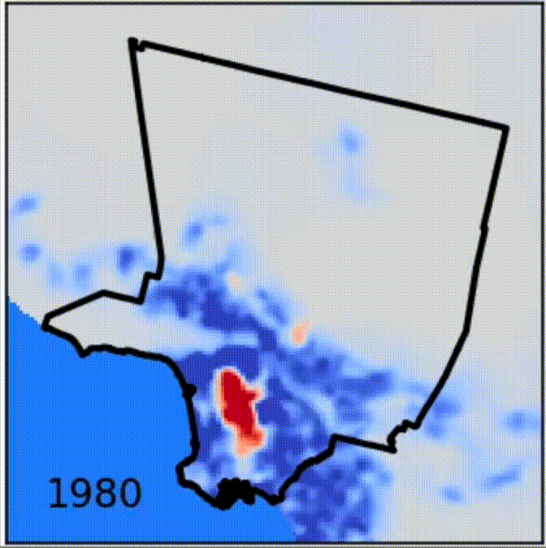

# Research Directions

Our group explores the mechanics and dynamics of complex systems comprising physical, biological, or social individuals. Throughout these disparate domains, we focus on far-from-equilibrium behaviors driven by interactions and nonlinearities. We are particularly interested in the impacts of simple information processing on self-organized, collective behavior.

Our tools include dynamical systems theory, physics-informed machine learning, statistical mechanics, and hydrodynamics. At every opportunity, we work in close collaboration with experimentalists.

See below for highlights of our research (ordered alphabetically, not in order of interest).

## [Active materials](#)

Active matter is driven out of equilibrium at the individual scale.
Our work uses theoretical modeling to understand pattern formation, flocking, and phase transitions in active systems, with applications from robotic to bacterial swarms.

Future work will focus information propagation in swarms with excitable, non-reciprocal interactions.

## [Living materials](#)

Biological systems coordinate both biochemical signaling and mechanical deformations for vital life processes across scales, from cell division to inflammatory responses.
We study the coupling between these, bridging chemical and mechanical activity with applications in development, disease, and bioengineering.

Future work will focus on controlling mechanical deformations via biochemical patterning.

## [Social materials](#)

Humans in urban environments are the epitome of complexity.
We take a novel approach towards understanding social systems, utilizing the tools of active matter and biological physics to understand the interplay between human activity and the environment they construct around them.

Future work will focus on the adaptive hydrodynamics of human activity and *omics* style analysis of urban data.

